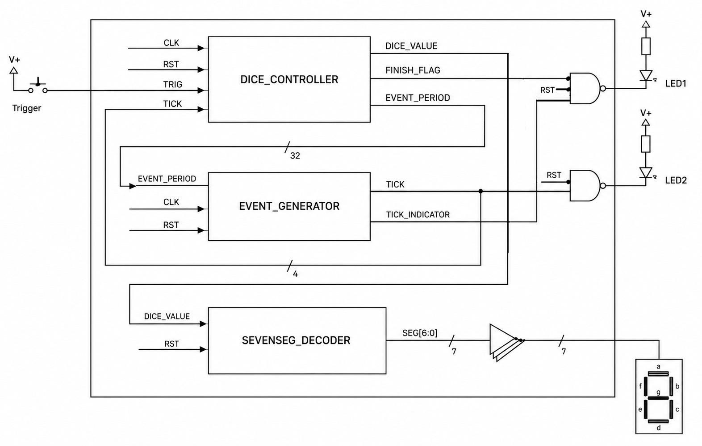

# Design Description

## 1. Overview

The design is implemented as a synchronous Verilog circuit.
It consists of three functional submodules and one top-level integration module.
The structure follows the laboratory requirement for a hierarchical HDL design.

## 2. Block Diagram



The diagram shows the three submodules (`DICE_CONTROLLER`, `EVENT_GENERATOR`, `SEVENSEG_DECODER`) and their interconnections inside the top-level module `main.v`.
External inputs are `CLK`, `RST` and `TRIG` (push button).
Outputs are `LED1`, `LED2` and the seven segment lines `SEG[6:0]`.
The 32-bit `EVENT_PERIOD` bus connects `DICE_CONTROLLER` to `EVENT_GENERATOR`, and the 4-bit `DICE_VALUE` bus connects `DICE_CONTROLLER` and `SEVENSEG_DECODER`.
`TICK` and `TICK_INDICATOR` are fed back from `EVENT_GENERATOR` into `DICE_CONTROLLER` and into the LED output logic.
Both LED outputs are driven through NAND gates with an active-low reset input, which forces `LED1` and `LED2` low while `RST` is asserted.
The seven segment signals pass through an inverting buffer array to produce the active-low `SEG[6:0]` output pins.

## 3. Top-Level Module: `main.v`

The top-level module connects all submodules.
It exposes the external clock, reset, trigger, LED and 7-segment interface.
It also converts internal active-high segment information into active-low output pins.

Important implementation points:

- `DICE_CONTROLLER` generates the dice value and finish status.
- `EVENT_GENERATOR` generates periodic ticks based on the period requested by the controller.
- `SEVENSEG_DECODER` converts the internal dice value into segment data.
- `LED1` is active low and indicates tick activity only while the round is not finished; it is gated by `RST` via a NAND gate.
- `LED2` is active low and reflects the finish state; it is also gated by `RST` via a NAND gate.
- `SEGCOM` is tied to logic 0.
- The reset signal (`rst_n` in the cocotb testbench, `RST` in the block diagram) is present at the top level and is distributed to all three submodules. See Section 8 and the note in the specification (Section 3) regarding reset polarity.

## 4. Dice Controller: `dice_controller.v`

The dice controller contains the behavioral core of the design.
It stores the current dice value, the one-second decay counter, the current decay level and the finish flag.

### Pressed State

When `TRIGGER` is high, the controller resets the decay logic.
The finish flag is cleared.
The dice value increments on each tick.
The event period remains at the base period because `decay_level` is reset to zero.

### Released State

When `TRIGGER` is low, the controller increments `second_counter` once per clock cycle.
After one second, `decay_level` is increased if it is below 6.
Once the maximum decay level has already been reached, the controller sets `finish_flag`.

The dice value continues to increment on tick events until `finish_flag` becomes active.
This creates the intended rolling-dice effect after release.

## 5. Event Generator: `event_generator.v`

The event generator creates a single-cycle `TICK` whenever its internal counter reaches the configured `EVENT_PERIOD - 1`.
It also generates `TICK_INDICATOR`, which remains active for a visible time after a tick.
The current implementation uses a fixed 500,000-cycle threshold to turn the indicator off again.
At 12 MHz, this corresponds to approximately 41.7 ms.
The code comment describes this as approximately 25 ms, which should be reviewed if exact LED timing is required.

## 6. 7-Segment Decoder: `sevenseg_decoder.v`

The 7-segment decoder maps a 4-bit `DICE_VALUE` input to a 7-bit segment pattern `SEG[6:0]`.
Although the electronic dice only uses values from 1 to 6, the decoder table defines values from 0 to F.
This is acceptable because it keeps the decoder reusable and simple.
The 7-bit output is inverted by the buffer array in `main.v` to produce the active-low segment pins (`SEGA` … `SEGG`).

## 7. Timing Behavior

The counting period is controlled by this expression:

```verilog
assign event_period = BASE_PERIOD << decay_level;
```

For a 12 MHz system clock and a base frequency of 40 Hz, the base period is 300,000 clock cycles.
Each decay level doubles the period.
This creates a slowdown that is easy to understand and simple to implement in hardware.

## 8. Implementation Notes

The current implementation includes a reset input (`RST` in the block diagram, `rst_n` in the cocotb testbench).
The testbench drives `rst_n = 1` for five clock cycles and then holds `rst_n = 0` during normal operation, which is the opposite of the usual active-low convention implied by the `_n` suffix.
The actual assertion polarity must be confirmed against the RTL.
If the naming is misleading, either the testbench signal name or the module port name should be corrected for clarity.

Register initialization is handled via `initial` blocks.
This is acceptable for many FPGA flows but should be reviewed if the design is prepared for ASIC fabrication, where `initial` blocks are typically not supported.

The current implementation does not debounce `TRIGGER`.
A real mechanical push button can bounce and may produce several fast input transitions.
For a robust hardware demonstration, an additional debounce module would be recommended.

`event_generator.v` declares `tickIndicator` both as an `output reg` and potentially as a local `reg` with initialization.
Some Verilog tools may reject a duplicate declaration.
If a syntax error occurs, remove the local redeclaration and handle initialization in an `initial` block or reset logic on the output declaration.

## 9. Design Traceability

| Design Element | Covered Requirements |
|---|---|
| `DICE_CONTROLLER` reset logic | REQ-001 |
| `DICE_CONTROLLER` value counter | REQ-002, REQ-003, REQ-004 |
| `DICE_CONTROLLER` decay logic | REQ-005, REQ-006 |
| `DICE_CONTROLLER` finish flag | REQ-007, REQ-009 |
| `EVENT_GENERATOR` tick output | REQ-004, REQ-008 |
| `EVENT_GENERATOR` tick indicator | REQ-008 |
| `SEVENSEG_DECODER` | REQ-010 |
| `main.v` output mapping | REQ-008, REQ-009, REQ-010 |
| `main.v` hierarchical instantiation | REQ-011 |
| `test (1).py` cocotb testbench | REQ-013 |
