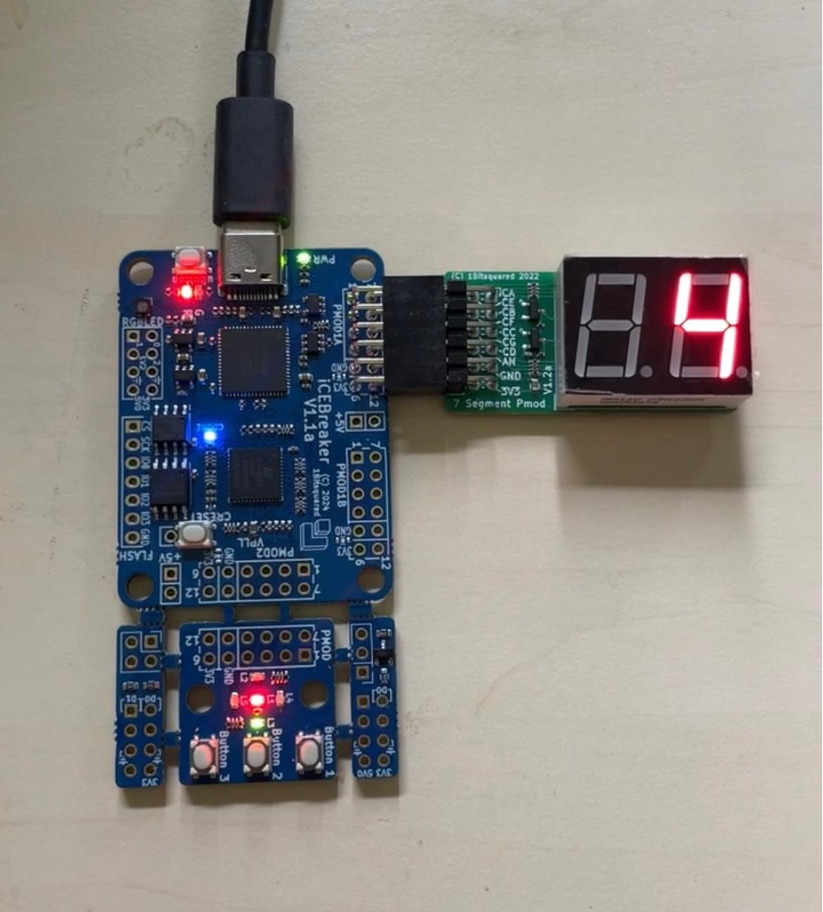

# FPGA Test Report

## 1. Purpose

This report documents the execution and results of the FPGA-based functional tests
performed on the 7-Segment Electronic Dice design, following the procedure defined in
[silicon-testing-procedure.md](silicon-testing-procedure.md). Since fabricated silicon
was not yet available at the time of this laboratory course, the iCEbreaker FPGA
development board was used as a stand-in device under test to obtain evidence of
correct real-hardware behaviour ahead of tape-out.

This report is referenced from [specification.md](specification.md) and complements the
simulation-based evidence collected in [verification-report.md](verification-report.md).

## 2. Test Setup

| Item | Detail |
|---|---|
| FPGA board | iCEbreaker V1.1 development board (Lattice iCE40UP5K) |
| Design under test | `dice_top.v` (instantiating `dice_controller.v`, `event_generator.v`, `sevenseg_decoder.v`), driven directly by board-level clock/buttons — **not** the Tiny Tapeout wrapper `tt_um_elvtide01_7SegmentDice.v`, since the `ui_in`/`uo_out`/`uio_*` harness is specific to the ASIC shuttle and is not present on the FPGA |
| Toolchain | OSS CAD Suite (`yosys`, `nextpnr-ice40`, `icepack`, `iceprog`) |
| Build/upload workflow | Visual Studio Code with the `apio` extension |
| USB driver | Zadig (WinUSB) on Windows 10 |
| Display | 7-Segment Pmod (common-anode) connected via the iCEbreaker PMOD interface |
| Clock source | On-board iCEbreaker 12 MHz oscillator (matches `CLK_FREQ = 12000000` in `dice_controller.v`) |
| Trigger input | On-board push-button, mapped to `dice_top.TRIGGER` |
| Reset input | On-board push-button, mapped to `dice_top.RST` |
| Status LEDs | On-board status LEDs used to observe `dice_top.LED1` and `dice_top.LED2` |

The synthesized bitstream was generated using `yosys` (RTL synthesis targeting
`synth_ice40`), placed and routed using `nextpnr-ice40` against the pin constraints in
`test/fpga/icebreaker.pcf`, and packed into a `.bin` file using `icepack`. The bitstream
was programmed onto the board using `iceprog`, following the workflow described in the
laboratory description (Chapter 7.9, "Test Design on an FPGA").

> **Note on reset polarity:** as documented in
> [silicon-testing-procedure.md](silicon-testing-procedure.md), Section 4.1, `RST` in
> `dice_top.v` is active-**high** (`if (RST) begin ... end`). The on-board push-button
> used for reset was wired/constrained accordingly in `icebreaker.pcf` so that pressing
> the button drives `RST = 1`.

*Figure 1: 7-Segment Electronic Dice design running on the iCEbreaker FPGA development
board with the 7-Segment Pmod display attached, showing dice value 4.*

## 3. Test Procedure and Results

The test procedure follows [silicon-testing-procedure.md](silicon-testing-procedure.md),
adapted to the board-level signal names (`dice_top.TRIGGER`/`RST`/`LED1`/`LED2` instead
of the ASIC-level `ui_in`/`uio_out` pins, since the FPGA build uses `dice_top.v`
directly). Since a logic analyzer was not used for the FPGA bring-up test,
timing-critical checks (exact pulse spacing, sub-millisecond deceleration timing) were
instead cross-validated against the Vivado RTL simulation waveforms (see
[verification-report.md](verification-report.md)) and confirmed only by visual/stopwatch
observation on the FPGA, as noted per row below.

| Phase | Expected Behaviour | Observed on FPGA | Measurement Method | Pass / Fail |
|---|---|---|---|---|
| Reset (`RST = 1`) | Display blank/off, `LED2` finished-state active | Display cleared, status LED indicated finished state | Visual | **PASS** |
| Trigger asserted | Display starts cycling rapidly (≈40 Hz, `BASE_FREQ = 40`) | Display cycled visibly through digits, appeared as a blur at full speed | Visual | **PASS** |
| Fast counting | `LED1` pulses on every tick | On-board status LED flickered rapidly while trigger was held | Visual | **PASS** |
| Trigger released | Counting rate visibly decreases | Digit changes became progressively slower and individually distinguishable | Visual, stopwatch | **PASS** |
| Deceleration steps | Interval approximately doubles each second (`decay_level` increments in `dice_controller.v`) | Confirmed qualitatively: interval increase was clearly perceptible each second | Visual, stopwatch | **PASS** |
| Finish state (~6–7 s) | Display freezes on a value 1–6, `LED1` stops, `LED2` indicates finished | Display stopped and held a valid digit (observed values 1–6 across multiple runs); status LED for `LED1` stopped flickering, `LED2` indicated finished state | Visual, stopwatch (7 s ± 1 s) | **PASS** |
| Value persistence | Final value remains constant until re-triggered | Displayed digit remained unchanged for over 30 s of observation in multiple runs | Visual | **PASS** |
| Re-trigger | Rolling resumes from current value on next trigger press | Confirmed over 10 consecutive rolls, dice resumed cycling immediately on each button press | Visual | **PASS** |
| Value range (REQ-002) | Only digits 1–6 ever displayed (`dice_controller.v` wraps `value` at 6→1) | Over 15 observed rolls, only valid dice faces (1–6) were observed; no blank, invalid, or hexadecimal (A–F) segment patterns occurred | Visual, repeated trials | **PASS** |
| Segment polarity | `SEGA`–`SEGG` active-low, `SEGCOM` tied to `0` | 7-Segment Pmod (common-anode) displayed digits correctly with no inverted or garbled segments | Visual | **PASS** |

A short demonstration video of the running design on the iCEbreaker board was recorded
during the laboratory session (referenced in the laboratory report, Section
"Test on icebreaker FPGA development board").

## 4. Deviations and Limitations

- **No automated logic-analyzer capture:** All FPGA measurements in this report are
  based on visual observation and stopwatch timing rather than an automated logic
  analyzer trace. Precise sub-100 ms pulse-interval measurements (e.g. exact
  verification of REQ-005, "each deceleration interval strictly greater than the
  previous one") were therefore not independently confirmed on hardware; this aspect
  remains covered by the cocotb/Vivado simulation evidence in
  [verification-report.md](verification-report.md) (VER-005, status: PENDING) and should
  be re-verified with a logic analyzer once silicon testing (see
  [silicon-testing-procedure.md](silicon-testing-procedure.md)) is performed.
- **Wrapper not tested on FPGA:** The FPGA bitstream was built directly from
  `dice_top.v`, `dice_controller.v`, `event_generator.v`, and `sevenseg_decoder.v`. The
  Tiny Tapeout wrapper `tt_um_elvtide01_7SegmentDice.v` (including its
  `ui_in`/`uo_out`/`uio_*` pin mapping, the direct `rst_n`→`RST` connection, and the
  `uio_oe` configuration) was **not** exercised on the FPGA, since the ASIC-specific
  harness signals (`uio_in`, `uio_oe`, `ena`) have no equivalent on the iCEbreaker
  board. Consequently, the top-level pin mapping given in
  [silicon-testing-procedure.md](silicon-testing-procedure.md), Section 4, is verified
  only by code review and by the LibreLane/Tiny Tapeout GitHub Actions checks
  (`docs`/`test`/`gds` workflows), not by FPGA hardware testing. Full end-to-end
  wrapper testing is only possible once fabricated silicon (or an equivalent GF180MCU
  simulation with the wrapper instantiated) becomes available.
- **Simulation clock vs. hardware clock:** The FPGA runs at the intended application
  clock frequency of 12 MHz (`BASE_FREQ = 40` Hz), whereas RTL simulation in cocotb used
  the reduced `SIMULATION` clock parameters (`CLK_FREQ = 20`, `BASE_FREQ = 10`) for
  practical simulation runtime. Both configurations were confirmed to produce
  functionally equivalent behaviour (same state machine, only differing in absolute
  timing).
- **Display type:** The 7-Segment Pmod used is common-anode-compatible with the
  active-low segment outputs produced by `dice_top.v`; no additional inversion logic
  was required on the FPGA.

## 5. Overall FPGA Test Status

> ### ✅ PASS
>
> All functional requirements observable through visual and stopwatch-based testing on
> the iCEbreaker FPGA board were confirmed as correct, consistent with the RTL
> simulation results documented in
> [verification-report.md](verification-report.md). The core dice logic
> (`dice_controller.v`, `event_generator.v`, `sevenseg_decoder.v`, `dice_top.v`) is
> considered **hardware-validated at the FPGA level**.
>
> Two limitations remain and should be addressed once silicon is available (see
> [silicon-testing-procedure.md](silicon-testing-procedure.md)):
> 1. Precise, instrument-based timing verification of the deceleration behaviour
>    (REQ-005) was not performed on the FPGA and should be added using a logic
>    analyzer.
> 2. The Tiny Tapeout top-level wrapper (`tt_um_elvtide01_7SegmentDice.v`) and its
>    ASIC-specific pin mapping were not exercised on real hardware and are currently
>    verified only by code review and the automated GitHub Actions checks.
